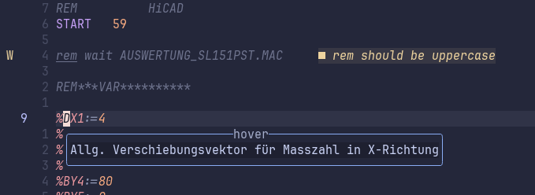

# None_hicad_lsp

Is a attempt to bring some LSP Information into neovim using none-lsp.
The reason for not doing a real lsp is, that its easier to use none-lsp.
The drawback is, that it only ever will work within neovim.

The main feature is hover information from existing excel files.
In init.lua one specifies as a extension for `none-lsp` as such: (lazy.nvim assumed)

```lua
{
  "petrisch/none_hicad_lsp",
  dependencies = {
    "none-ls.nvim",
    opts = function(_, opts)
      opts.root_dir = opts.root_dir
        or require("null-ls.utils").root_pattern(".null-ls-root", ".neoconf.json", "Makefile", ".git")
      opts.sources = vim.list_extend(opts.sources or {}, {
        require("none_hicad_lsp").setup({
          lsp = {
            source = {
              "PATH_TO_A_EXCEL_FILE_THAT_IS_STRUCTURED_LIKE_THE_BUILTIN_EXAMPLE",
              "MULTIPLE_POSSIBLE",
            },
            table = "VAR",
            name_column = "column1",
            description_column = "column2",
          },
        }),
      })
    end,
  },
},
```

For a start, there is the `./HiCAD_Builtin_2D3DVar.xlsx` file,
that can be used with the `Test.mac` file.

## Dependencies

I was unable to read a excel file from lua,
thats why it calls a nushell script, that gets the information as strings
into lua. So [nushell](https://www.nushell.sh) is a dependency here.

## Current state

- Can get variable infos from a list of sources.
- Gives basic inlay hint info about malformed comments, which is opiniated of course.

Feedback and ideas for more usecases are highly apprecited.



## Motivation

In the HCGS macro language used to be the case,
that only 4 characters long variable names were allowed.
This made it hard to understand their meaning,
so many users were keeping track of them in a seperate file eg. excel.
This plugin brings the additional information of them into the editor.

## Todo

- [x] Get hard coded path to lsp_source.nu script as relative path to config/lua
- [x] Get the word to lookup from the tree-sitter node, so that `$VAR` and `VAR` can equaly be hovered.
- [x] Make this a external plugin
- [ ] Let user specify every column and table per source
- [ ] Get rid of nushell as a dependency maybe using nur packager.
- [ ] Get Diagnostics about comments from tree-sitter as well, because of fals-positivs
